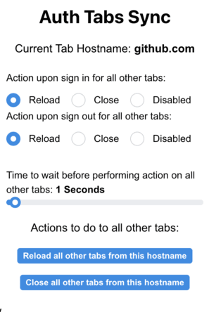

# AuthTabsSync

AuthTabsSync is a Chrome extension designed to enhance your browsing experience by synchronizing actions across all tabs with the same hostname. Built with TypeScript and React, and utilizing the Mantine component library, AuthTabsSync automatically reloads or closes all other tabs with the same hostname whenever you log into a website, ensuring that your session is consistently updated across multiple tabs.

## Features

- **Automatic Tab Synchronization:** Detects login pages and synchronizes actions across all tabs with the same hostname.
- **Customizable Actions:** Choose to either reload or close tabs with the same hostname upon login detection.
- **Seamless Integration:** Works in the background without disrupting your browsing experience.

## Installation

1. Download the AuthTabsSync extension from the Chrome Web Store.
2. Click "Add to Chrome" to install the extension.
3. Once installed, the AuthTabsSync icon will appear in your Chrome toolbar.

## Building

1. Clone the repo
2. Run npm install
3. Run npm build
4. Load dist directory into chrome extension

## Settings

1. Click on the AuthTabsSync icon in your Chrome toolbar.
2. Choose your preferred action (reload or close tabs) for synchronization.

## License

This project is licensed under the MIT License - see the [LICENSE](LICENSE) file for details.

## Contact

For questions or feedback, please reach out to us at [sgcooper78@gmail.com](mailto:sgcooper78@gmail.com).
